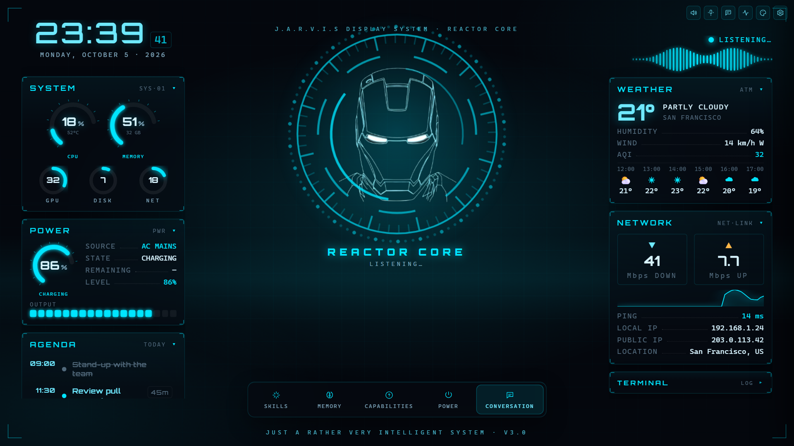

<div align="center">

# J.A.R.V.I.S. for Windows

**A voice assistant that actually does things on your PC.**
Say *"Hey Jarvis"*, ask for something, and it answers out loud, drives a browser,
clicks through desktop apps, and remembers you. All from an Iron-Man-style HUD.

[](https://github.com/AnaaySampat/jarvis-windows/actions/workflows/ci.yml)

[](LICENSE)
[](https://github.com/AnaaySampat/jarvis-windows/releases/latest)



<sub>Screenshot shows demo data.</sub>

</div>

## Why it's different

Most desktop assistants stop at answering questions. JARVIS hands the task to an
**autopilot** that reads the screen, plans the steps, acts, checks each step
landed, and corrects itself when it didn't.

- **"Find a carbonara recipe and open it"**: it drives its own Chromium, reads the
  page, clicks, types and verifies.
- **"Open Notepad and write a shopping list"**: it reads the Windows accessibility
  tree and works real desktop apps, behind an explicit time-limited consent and a
  corner-of-the-screen abort.
- **From your phone**: pair it over Tailscale and send tasks, watch the PC live,
  and take over the mouse and keyboard, all end-to-end on your own network.

## Features

| | |
|---|---|
| 🎙️ **Hands-free voice** | Local wake word ("Hey Jarvis") and local Whisper transcription. Push-to-talk with **Ctrl+Space** from any app. Full-duplex voice mode via Gemini Live. |
| 🧠 **Any model, routed for you** | Bring keys for Groq, Gemini, OpenRouter, NVIDIA NIM, Mistral, Claude, OpenAI, Grok or Meta Llama. **Auto** ranks your models by benchmark and picks per request, falling back when one is rate-limited. Vertex AI (Google Cloud login) and offline Ollama work too. |
| 🌐 **Browser autopilot** | Goal in, result out. Sandboxed to a browser JARVIS owns, with approvals for anything risky. Watch every step and screenshot in the Agent Activity panel. |
| 🖥️ **Desktop control** | Opens, closes and operates Windows apps through UI Automation. Off until you arm it, with a live "JARVIS CONTROLLING" bar to pause or correct it. |
| 📱 **Phone remote** | QR + PIN pairing, signed messages, WebRTC screen streaming. A phone can run tasks but can never touch the PC's keys or settings. |
| 📊 **Rich answers** | Charts, tables, timelines and flowcharts render inline in the chat. |
| 💾 **Memory & playbooks** | "Remember that…" keeps facts across sessions. Teach a multi-step routine once and it reuses it. Everything is stored locally and viewable in the Memory panel. |
| ⏰ **Everyday stuff** | Reminders, timers, recurring routines, a voice-editable agenda, weather, nearby places, directions, news, web search with citations. |
| 🛠️ **PC actions** | Volume, power, screenshots, screen/voice/video recording, QR codes, AI images, PDF read/write, speed test, camera OCR with translation. |
| 🎨 **Make it yours** | Restyle the HUD by voice: colours, background, density and panel layout. Voices: Piper (offline), ElevenLabs or Google Chirp 3 HD. |

## Download

Grab the installer from the **[latest release](https://github.com/AnaaySampat/jarvis-windows/releases/latest)**.

- It bundles everything (backend, Chromium, Whisper, the Piper voice), so it works
  offline right after install. No Python needed.
- On first launch, paste one API key ([Groq](https://console.groq.com/keys) and
  [Gemini](https://aistudio.google.com/apikey) both have free tiers) and choose where
  JARVIS saves its files.
- The installer isn't code-signed yet, so Windows SmartScreen will warn you. Click
  **More info → Run anyway**.

## Run from source

Requires Windows 10/11, Python 3.11+, Node.js 20+ and the Rust toolchain.

```powershell
git clone https://github.com/AnaaySampat/jarvis-windows.git
cd jarvis-windows

# Backend
cd jarvis-studio-backend
python -m venv .venv
.venv\Scripts\activate
pip install -r requirements.txt
playwright install chromium     # for the browser autopilot
cd ..

# GUI
cd jarvis-studio-gui
npm install
cd ..

# Launch both
python start.py
```

`python jarvis-studio-backend\main.py --text` runs the backend with typed input
instead of the mic.

Every optional package fails soft. If one is missing, only its feature turns off,
and JARVIS tells you what to `pip install`.

<details>
<summary>Which package powers which feature</summary>

| Feature | Package(s) |
|---|---|
| Vertex AI (Gemini / Imagen / Chirp / Vision) | `google-auth` + `gcloud auth application-default login` |
| Browser autopilot | `playwright` + `playwright install chromium` |
| Camera OCR | Cloud Vision via Vertex, or local `easyocr` + `opencv-python` + `pillow` |
| Live HUD telemetry | `psutil` (GPU gauge: `nvidia-ml-py` or `GPUtil`) |
| Exact volume control | `pycaw`, `comtypes` |
| Screenshots / QR codes | `mss` or `pillow` / `qrcode` |
| PDFs | `pypdf` (read), `fpdf2` (write) |
| Video recording | `opencv-python` |
| Speed test | `speedtest-cli` |
| Phone pairing | `cryptography` + Tailscale on both devices |
| Live remote desktop | `aiortc` |

</details>

## How it works

```
  Phone                                Desktop
  ─────────────────────                ─────────────────────────────────────
  signed envelopes  ──── Tailscale ──▶ +-------------------+
  WebRTC video      ◀───  (100.64/10)  |   JARVIS HUD      |
                                       |  (Tauri + React)  |
                                       +-------------------+
                                            │ WebSocket ws://127.0.0.1:8765
                                            ▼
  +------------------------------------------------------------------+
  |              Python backend (jarvis-studio-backend)               |
  |  openWakeWord → faster-whisper → LLM router → TTS                 |
  |  autopilot.py (browser + desktop operators) · task_router.py      |
  |  actions/ · llm/ · server/ (ws + webrtc) · autonomy/ (pairing)    |
  +------------------------------------------------------------------+
```

One WebSocket server serves both the local HUD (loopback, full access) and a paired
phone (signed, allowlisted). A deterministic router (`task_router.py`) decides
whether a goal needs the browser or the desktop before any model commits to one.

| Path | What's there |
|---|---|
| `jarvis-studio-backend/` | `main.py` (handlers + orchestration), `autopilot.py`, `actions/`, `llm/` (routing, model catalog), `server/`, `autonomy/` (pairing crypto), `transcription/`, `tts/`, `wake_word/` |
| `jarvis-studio-gui/` | Tauri 2 + React HUD: main window, status pill overlay, browser panel, control bar |
| `scripts/` | Installer build scripts |
| `start.py` | Launches backend + GUI for development |

## Privacy

- Wake word and transcription run **on your PC**. Mic audio stays local, except in
  the optional Gemini Live voice mode, which streams it to Google.
- What you say (as text), plus camera frames when you use OCR, goes to the AI
  provider you chose.
- API keys and settings live in `%APPDATA%\Jarvis\`, never in the project folder.
- Memory, chats and everything JARVIS creates stay on your disk (default `~/Jarvis`).
- Phone pairing stays on your own devices and Tailscale network. No relay, broker
  or account in between.

## Development

```powershell
# Backend tests: no network or API keys needed
cd jarvis-studio-backend
python -m unittest discover -s . -p "test_*.py" -t .

# GUI
cd jarvis-studio-gui
npm test
npm run lint
npm run build
```

CI runs all of these on every push. Build the Windows installer with
`.\scripts\build.ps1`. It freezes the backend with PyInstaller, bundles the runtime
assets, and writes the NSIS installer to
`jarvis-studio-gui\src-tauri\target\release\bundle\nsis\`. Add `-Lean` to
`scripts\package-backend.ps1` for a small installer that downloads assets on first run.

## Contributing

Bug reports and pull requests are welcome. See [CONTRIBUTING.md](CONTRIBUTING.md)
and the [Code of Conduct](CODE_OF_CONDUCT.md). Found a security issue? Please
report it privately as described in [SECURITY.md](SECURITY.md), not in a public issue.

## License

MIT. See [LICENSE](LICENSE).

**Wake-word model:** the bundled `hey_jarvis` model comes from
[openWakeWord](https://github.com/dscripka/openWakeWord) by David Scripka. Its code
is Apache 2.0, but its pre-trained models are
**[CC BY-NC-SA 4.0](https://creativecommons.org/licenses/by-nc-sa/4.0/)**, which
forbids commercial use. For a commercial build, train your own model and put it
at `jarvis-studio-backend/wake_word/models/hey_jarvis.onnx`, or point
`JARVIS_WAKE_MODEL_PATH` at it.

*JARVIS and Iron Man are trademarks of Marvel. This is an unofficial fan project,
not affiliated with or endorsed by Marvel or Disney.*
